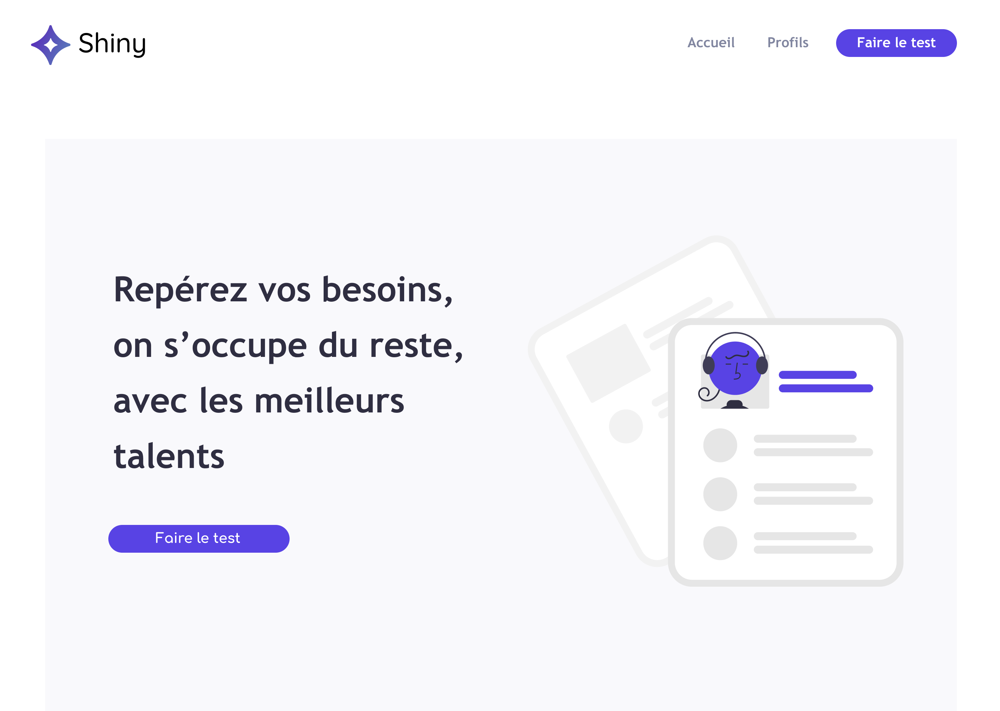
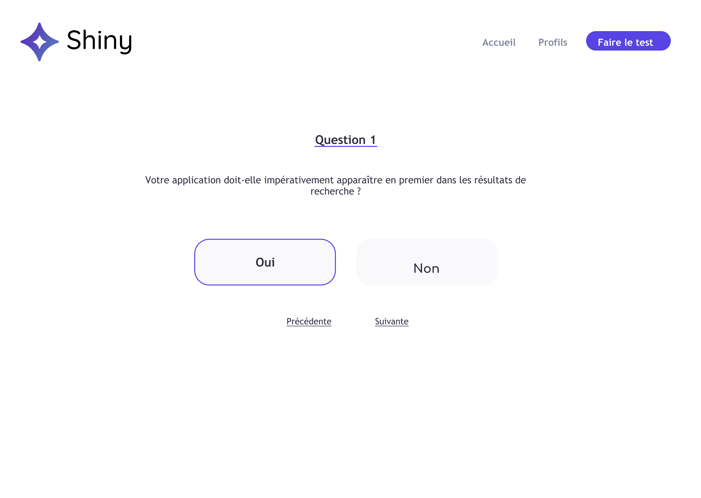
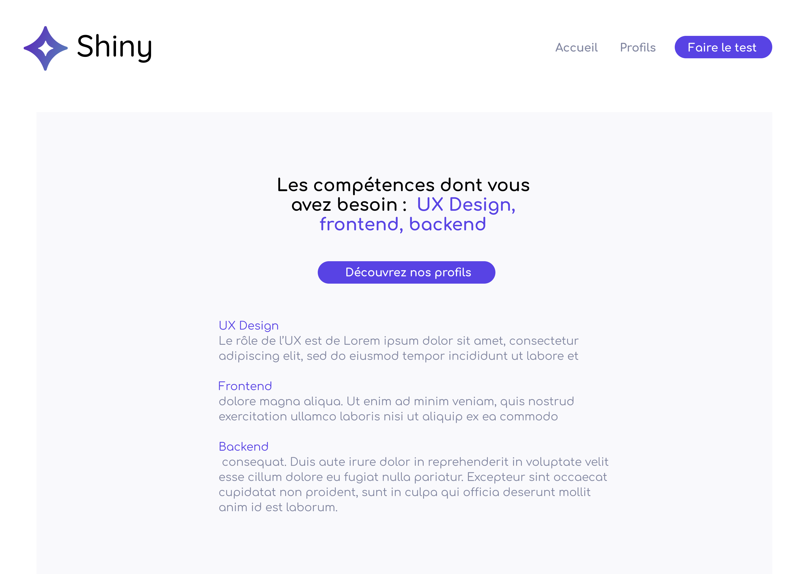
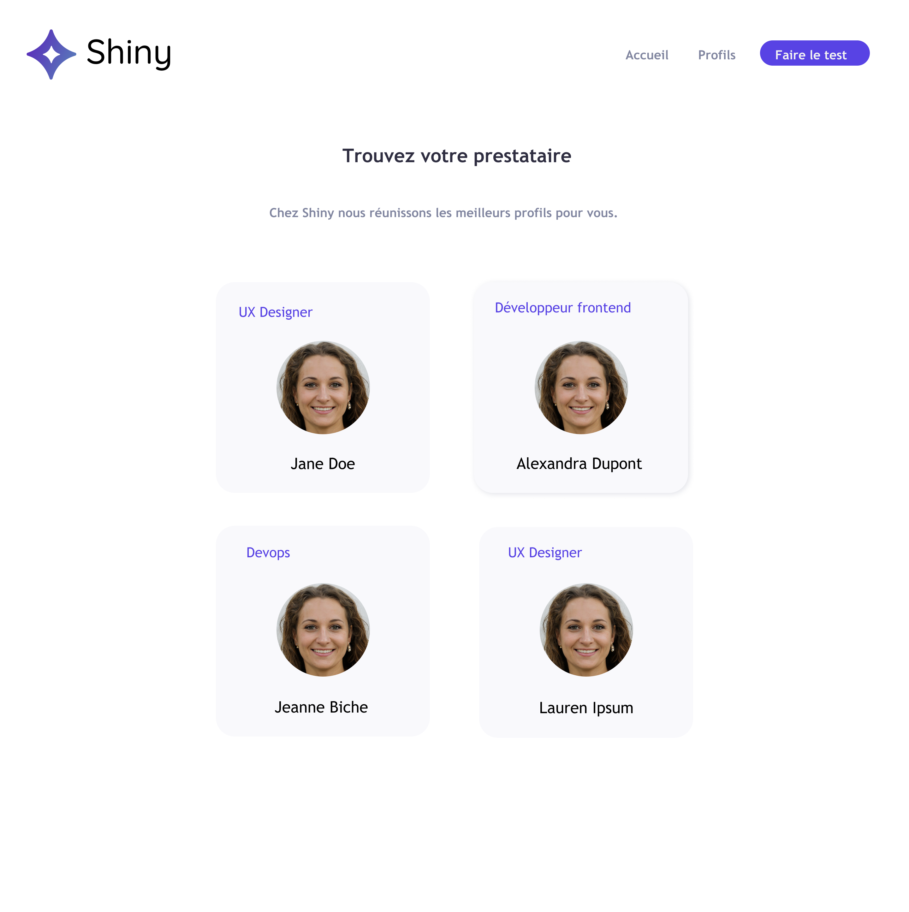
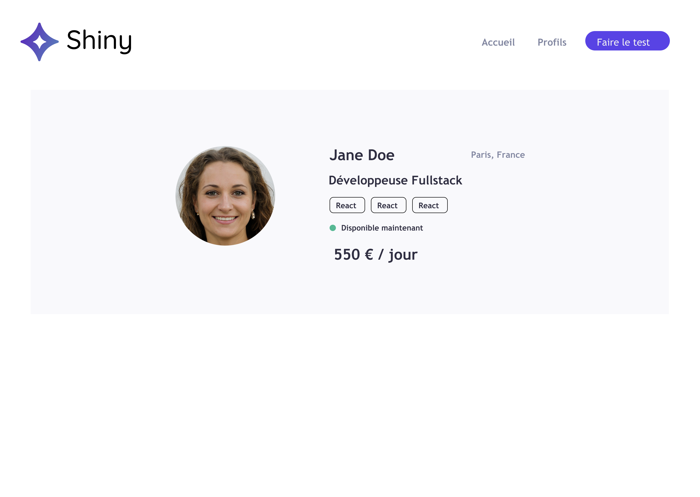
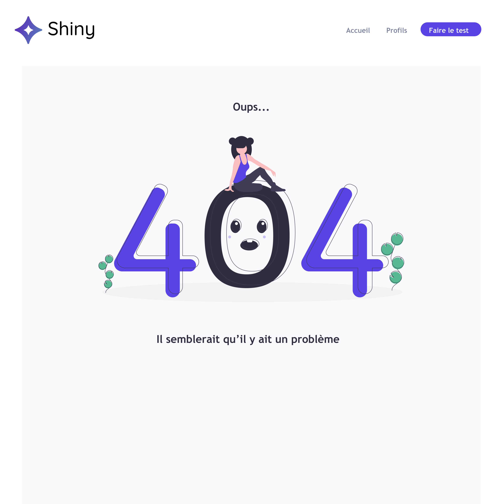

# Shiny

Un site pour une agence de freelances

Exercice du cours [Créez une application React complète](https://openclassrooms.com/fr/courses/7150606-creez-une-application-react-complete) d'OpenClassrooms

Lien [figma](https://www.figma.com/file/KlrToaA7Dj1Sm0opq37ICg/React-interm%C3%A9diaire?node-id=0%3A1)

